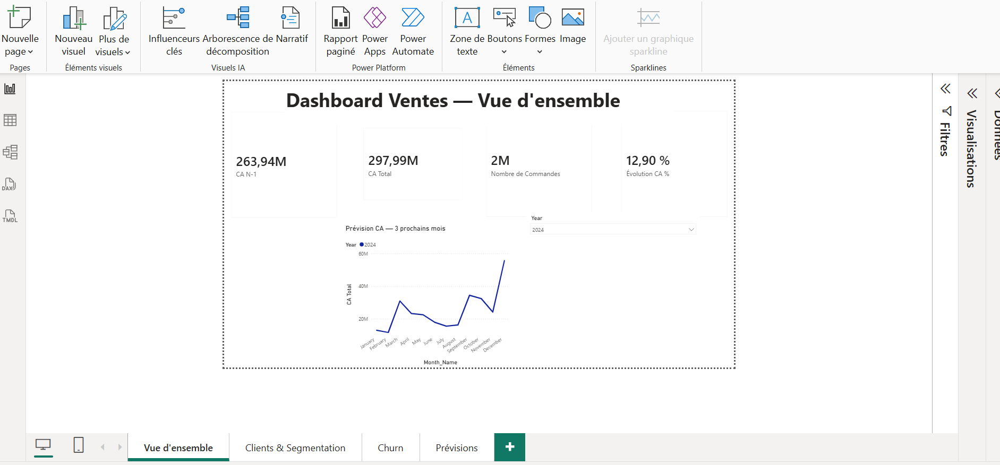
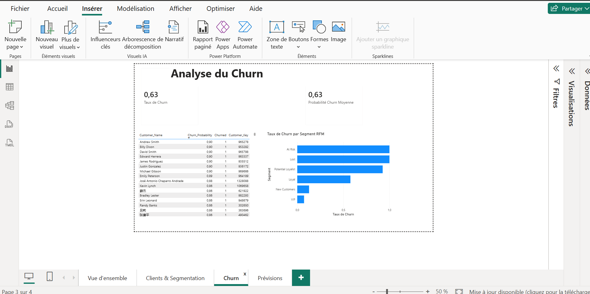

# Fashion E-commerce Intelligence Platform

Pipeline data de bout en bout sur **6,4 millions de lignes de ventes** d'une enseigne de mode présente dans 7 pays : audit et nettoyage des données, entrepôt SQL Server en étoile, analyse exploratoire, segmentation client RFM, prédiction du churn, prévision du chiffre d'affaires et dashboard Power BI.

**Stack :** Python (pandas, scikit-learn, statsmodels, SciPy) · SQL Server (T-SQL) · Power BI

---

## Problème métier

Une enseigne de mode multi-pays veut piloter son activité à partir de ses données de caisse :

1. **Suivre la performance** : CA, croissance, saisonnalité, pays et catégories qui portent le chiffre d'affaires.
2. **Connaître ses clients** : lesquels génèrent le CA, lesquels sont en train de décrocher (segmentation RFM).
3. **Anticiper** : quels clients risquent de ne plus acheter (churn) et quel CA attendre sur les prochains mois (prévision).

## Données

Dataset public Kaggle **Global Fashion Retail Sales** — données **synthétiques** (voir [`data/README.md`](data/README.md) pour le téléchargement).

| Table | Lignes | Contenu |
|---|---|---|
| transactions | 6 416 827 | lignes de facture (ventes et retours), 4 devises |
| customers | 1 643 306 | profil client (données personnelles fictives) |
| products | 17 940 | catégorie, sous-catégorie, coût de production |
| discounts | 181 | calendrier des promotions |
| employees | 404 | vendeurs par magasin |
| stores | 35 | magasins (États-Unis, Chine, Allemagne, Royaume-Uni, France, Espagne, Portugal) |

Période : **1er janvier 2023 → 18 mars 2025** (mars 2025 incomplet).

---

## Architecture

```
data/raw/*.csv
    │  src/etl.py            nettoyage + modèle en étoile (règles justifiées dans le notebook 01)
    ▼
data/processed/*.csv
    │  src/load_to_sql_server.py   dimensions (pandas) + faits (BULK INSERT via staging)
    ▼
SQL Server — schéma warehouse
    │  vw_Fact_Sales_USD     conversion de toutes les ventes en USD (source unique des analyses)
    ▼
Notebooks 03-06 (EDA, RFM, churn, prévision) ──► résultats réinjectés dans SQL Server
    ▼
Power BI (4 pages)
```

**Modèle en étoile :** `Fact_Sales` (grain : une ligne de facture, ventes et retours) reliée à `Dim_Date`, `Dim_Customer`, `Dim_Product`, `Dim_Store` (-> `Dim_Employee`) et `Dim_Currency` ; `Dim_Discount` est une table de référence autonome.

---

## Étapes et résultats

### 1. Audit et nettoyage des données — [`01`](notebooks/01_data_audit.ipynb), [`02`](notebooks/02_data_cleaning_star_schema.ipynb)

| Problème détecté | Décision |
|---|---|
| 798 lignes dupliquées (retours enregistrés 2 à 3 fois) | suppression |
| Remise à 0 sur 98 295 retours alors que le remboursement correspond au prix remisé payé | **remise reconstituée** à partir du montant remboursé : `Line Total = ±Prix x Qté x (1 − Remise)` devient vrai sur 100 % des lignes |
| ~41 000 retours distincts partageant un même numéro de facture | conservés ; clé technique `Sale_Key` en base plutôt que `(Invoice_ID, Line)` |
| `Color` manquant à 68 %, `Job Title` à 36 %, `Sizes` à 12 % | `Unknown` / `N/A` (non récupérables, jamais utilisés dans un calcul de montant) |
| Promotions globales sans catégorie | `All` |
| Pays et villes en langue locale (`中国`, `España`…) | traduction en anglais |
| Ventes en USD, EUR, GBP et CNY | conversion en USD dans une vue SQL (ne jamais additionner des devises différentes) |

Contrôles automatisés avant chargement : aucune clé étrangère orpheline, clés primaires uniques, cohérence financière vérifiée ligne à ligne.

### 2. Analyse exploratoire — [`03`](notebooks/03_eda.ipynb)

**298,7 M$ de CA brut**, 4,3 millions de commandes, panier moyen de 69 $, 5,6 % du CA retourné.

- **Croissance de +12,9 %** du CA en 2024 par rapport à 2023.
- **Saisonnalité très forte et stable** : pics en mars, septembre-octobre et surtout décembre (3 fois un mois moyen).
- **États-Unis et Chine réalisent chacun 27 % du CA** ; les costumes (homme et femme) sont les premières sous-catégories ; l'enfant ne pèse que 9 %.
- **Marge brute d'environ 61 %**, homogène entre catégories.
- **Les remises n'augmentent pas les quantités achetées** (Mann-Whitney, p = 0,65, taille d'effet nulle) — résultat observationnel, non causal.

### 3. Segmentation RFM — [`04`](notebooks/04_rfm_segmentation.ipynb)

1,28 million de clients acheteurs répartis en 6 segments (VIP, Loyal, New Customers, Potential Loyalist, At Risk, Lost), avec une recommandation d'action par segment.

| Segment | % des clients | % du CA |
|---|---|---|
| VIP | 22,6 % | **43,3 %** |
| Loyal | 18,6 % | 23,4 % |
| At Risk | 11,0 % | 13,0 % |
| Lost | **28,8 %** | 11,7 % |
| New Customers | 10,8 % | 4,5 % |
| Potential Loyalist | 8,2 % | 4,1 % |

Résultat clé : **41 % des clients (VIP + Loyal) font 67 % du CA**. La priorité de réactivation est le segment **At Risk** : 141 000 anciens clients réguliers, 13 % du CA, sans achat depuis ~11 mois.

### 4. Prédiction du churn — [`05`](notebooks/05_churn_prediction.ipynb)

- **Churn** = aucun achat dans les 90 jours suivant la date d'observation (63 % des clients).
- **Protocole sans fuite de données** : features calculées uniquement sur l'historique passé (fonction SQL paramétrée), **validation temporelle** (entraînement sur le snapshot de septembre 2024, test sur celui de décembre 2024).

| Modèle (période de test) | ROC-AUC | PR-AUC | Lift top 10 % |
|---|---|---|---|
| Aléatoire | 0,500 | 0,631 | 1,00 |
| Baseline : tri par récence | 0,576 | 0,689 | 1,17 |
| **Régression logistique** (retenue) | **0,640** | **0,723** | **1,19** |
| Gradient Boosting | 0,640 | 0,723 | 1,19 |

- Le modèle bat la baseline métier, mais la performance reste **modeste** et est présentée telle quelle : données synthétiques, uniquement des variables transactionnelles. La **fréquence d'achat** porte l'essentiel du signal.
- À performance égale, le modèle **le plus simple** est retenu.
- Sortie : probabilité de churn et décile de risque pour chacun des 1,28 million de clients, à la dernière date disponible.

### 5. Prévision du CA — [`06`](notebooks/06_revenue_forecasting.ipynb)

Validation sur janvier-février 2025 :

| Modèle | MAPE |
|---|---|
| **Naïf saisonnier** (même mois l'année précédente) | **2,0 %** |
| Naïf saisonnier + croissance | 14,6 % |
| Holt-Winters | 38,9 % |

- Enseignement : le modèle statistique fait **nettement moins bien** qu'une simple baseline, car la saisonnalité est très stable et l'historique ne couvre que 2 cycles. **Toujours se comparer à une baseline naïve.**
- Prévision retenue : **15,2 M$ en mars, 11,5 M$ en avril, 11,2 M$ en mai 2025**.

### 6. Dashboard Power BI

4 pages alimentées par SQL Server : vue d'ensemble, clients et segmentation RFM, churn, prévisions (avec l'erreur de validation affichée à côté de la prévision).

> Les captures correspondent à la première version du dashboard (prévision Holt-Winters, churn historique). Les résultats de référence sont ceux des notebooks ci-dessus.

| Vue d'ensemble | Segmentation RFM |
|---|---|
|  |  |
| **Churn** | **Prévisions** |
|  |  |

---

## Limites et hypothèses

- **Données synthétiques** : les résultats valident une méthode plus qu'ils ne décrivent un marché réel (les comportements y sont très réguliers et en partie aléatoires).
- **Taux de change fixes** : la source ne fournit pas de taux ; la conversion USD utilise des taux moyens de marché 2023-2024 (EUR 1,08 · GBP 1,27 · CNY 0,1391), stockés dans `warehouse.Dim_Currency` et modifiables en un seul endroit. Les écarts de prix d'un même produit entre pays ne peuvent pas servir de taux : ils reflètent des grilles tarifaires locales.
- **Coût de production supposé en USD** pour le calcul des marges.
- **Historique court** (26 mois complets) : la prévision est un ordre de grandeur, validée sur 2 mois seulement.
- **Churn à 90 jours** : dans la mode, beaucoup de clients n'achètent pas chaque trimestre ; une fenêtre de 180 jours serait plus proche d'un « vrai » churn.
- **RFM et churn ne doivent pas être croisés naïvement** : la récence actuelle contient déjà l'information du label de churn historique (raisonnement circulaire).

---

## Structure du repository

```
├── data/                      # non versionné — voir data/README.md
│   ├── raw/                   # CSV sources
│   └── processed/             # tables du modèle en étoile (sortie de src/etl.py)
├── notebooks/
│   ├── 01_data_audit.ipynb
│   ├── 02_data_cleaning_star_schema.ipynb
│   ├── 03_eda.ipynb
│   ├── 04_rfm_segmentation.ipynb
│   ├── 05_churn_prediction.ipynb
│   └── 06_revenue_forecasting.ipynb
├── sql/
│   ├── 01_create_database.sql       # base + schémas staging / warehouse
│   ├── 02_create_tables.sql         # modèle en étoile, contraintes, index, taux de change
│   ├── 03_create_views.sql          # vw_Fact_Sales_USD
│   ├── 04_business_analytics.sql    # requêtes métier (KPI, marges, retours, magasins)
│   ├── 05_rfm.sql                   # table Customer_RFM
│   └── 06_churn_features.sql        # fonction fn_Churn_Features(@Snapshot_Date, @Window_Days)
├── src/
│   ├── config.py                    # chemins et paramètres (.env)
│   ├── db.py                        # connexion SQL Server
│   ├── etl.py                       # nettoyage + modèle en étoile + contrôles
│   ├── load_to_sql_server.py        # chargement idempotent
│   └── plotting.py                  # style graphique commun
├── docs/screenshots/                # captures du dashboard
├── .env.example
└── requirements.txt
```

---

## Reproduire le projet

**Prérequis :** Python 3.10+, SQL Server 2017+ (local, distant ou Docker — voir plus bas) avec le pilote ODBC 17 ou 18, Power BI Desktop.

```bash
# 1. Environnement
python -m venv .venv
.venv\Scripts\activate            # Windows  (macOS/Linux : source .venv/bin/activate)
pip install -r requirements.txt
cp .env.example .env              # puis renseigner le serveur SQL

# 2. Données : placer les 6 CSV dans data/raw/ (voir data/README.md)

# 3. Nettoyage + modèle en étoile
python -m src.etl

# 4. Base de données : exécuter sql/01 -> sql/03 (SSMS ou sqlcmd), puis charger
python -m src.load_to_sql_server

# 5. Tables analytiques : exécuter sql/05_rfm.sql et sql/06_churn_features.sql

# 6. Analyses : exécuter les notebooks 03 -> 06 (ils réinjectent leurs résultats dans SQL Server)
```

Les notebooks 01 et 02 documentent l'audit et le nettoyage ; ils ne sont pas nécessaires pour reproduire les tables (`python -m src.etl` fait le même travail).

> Le `BULK INSERT` lit le fichier CSV depuis le serveur : le compte de service SQL Server doit avoir accès au dossier `data/processed/`.

**Sans SQL Server installé : Docker.** SQL Server 2022 peut tourner dans un conteneur, avec les dossiers `data/processed` et `sql` montés en lecture seule :

```bash
docker run -d --name fashion_mssql -e ACCEPT_EULA=Y -e MSSQL_SA_PASSWORD="<mot de passe fort>" \
  -p 1433:1433 -v "$(pwd)/data/processed:/data/processed:ro" -v "$(pwd)/sql:/sql:ro" \
  mcr.microsoft.com/mssql/server:2022-latest
```

Dans `.env` : `DB_SERVER=localhost,1433`, `DB_USER=sa`, `DB_PASSWORD=<mot de passe>`, `DB_DRIVER=ODBC Driver 18 for SQL Server` et `DB_BULK_DATA_DIR=/data/processed` (chemin du CSV vu par le conteneur). Les scripts SQL s'exécutent alors avec `docker exec fashion_mssql /opt/mssql-tools18/bin/sqlcmd -S localhost -U sa -P "<mot de passe>" -C -i /sql/01_create_database.sql`, et ainsi de suite.
