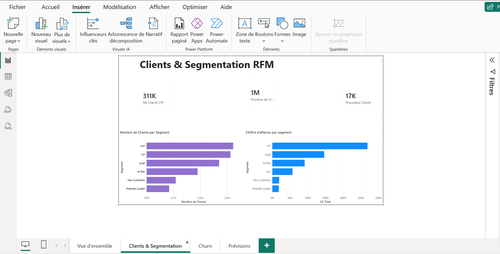
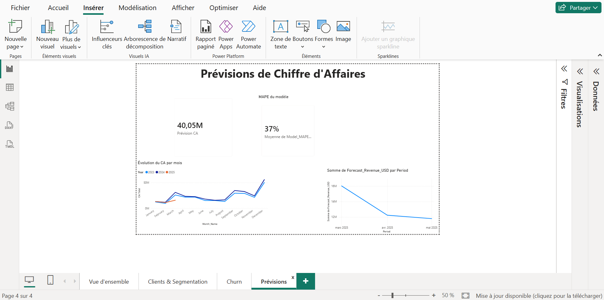

# Fashion E-commerce Intelligence Platform

Pipeline data analytics de bout en bout sur un dataset e-commerce mode multi-devises : nettoyage et modélisation en étoile sous SQL Server, segmentation client (RFM), prédiction de churn, prévision de chiffre d'affaires, et dashboard Power BI.

> Premier projet data analyst — construit du CSV brut jusqu'au dashboard, avec une attention particulière portée à la qualité des données et à la transparence sur les limites de chaque modèle.

---

## Aperçu du projet

| | |
|---|---|
| **Domaine** | E-commerce mode, ventes multi-devises, multi-pays |
| **Volume** | 6,4M lignes de transactions · 1,64M clients · 17,9K produits · 35 magasins |
| **Période couverte** | ~27 mois d'historique |
| **Stack** | Python (pandas, scikit-learn, statsmodels) · SQL Server · Power BI |
| **Livrables** | Data warehouse en étoile, 3 modèles ML/statistiques, dashboard Power BI 4 pages |

---

## Architecture du pipeline

```
CSV bruts (raw)
      │
      ▼
Data Understanding → Data Quality → Data Cleaning   (Python / pandas)
      │
      ▼
Data Transformation — modélisation en étoile (star schema)
      │
      ▼
SQL Server (BULK INSERT + staging)
      │
      ▼
EDA · RFM Segmentation · Churn Prediction · Revenue Forecasting   (Python)
      │  (résultats réinjectés dans SQL Server)
      ▼
Power BI  —  Dashboard 4 pages
```

### Modèle de données (star schema)

```
                 Dim_Customer
                      │
Dim_Date ──────── Fact_Sales ──────── Dim_Product
                      │
                 Dim_Store ── Dim_Employee

Dim_Discount : table de référence autonome (périodes promo par catégorie),
               jointe à la demande — pas de FK directe sur Fact_Sales
               (le taux de remise est déjà présent sur chaque ligne de vente).
```

---

## Structure du repo

```
├── data/
│   ├── raw/            # CSV sources (customers, products, transactions, ...)
│   ├── cleaned/         # après 01-03 : nettoyage, valeurs manquantes traitées
│   └── processed/       # après 04 : tables du star schema, prêtes pour SQL Server
│
├── notebooks/
│   ├── 01_data_understanding.ipynb
│   ├── 02_data_quality.ipynb
│   ├── 03_data_cleaning.ipynb
│   ├── 04_data_transformation.ipynb
│   ├── 05_eda.ipynb
│   ├── 06_rfm_segmentation.ipynb
│   ├── 07_churn_prediction.ipynb
│   └── 08_forecasting.ipynb
│
├── python/
│   ├── load_to_sql_server.py        # chargement dimensions + Fact_Sales (BULK INSERT)
│   ├── load_fact_only.py            # rechargement Fact_Sales via table staging
│   └── diagnose_fact_duplicates.py  # diagnostic doublons (Invoice_ID, Line)
│
├── sql/
│   ├── 01_create_database.sql
│   ├── 02_create_tables.sql
│   ├── 03_business_analytics.sql
│   ├── 04_rfm.sql
│   └── 05_churn_features.sql
│
├── power bi/
│   └── dashboard.pbix
│
├── documentation/
│   └── screenshots/      # captures des 4 pages du dashboard (à ajouter)
│
├── requirements.txt
└── .gitignore
```

---

## Pipeline détaillé

### 1–3. Data Understanding, Quality & Cleaning

Exploration et audit qualité sur les 6 fichiers sources bruts avant toute transformation.

**Volumes bruts :**

| Table | Lignes | Colonnes |
|---|---|---|
| Transactions | 6 416 827 | 19 |
| Customers | 1 643 306 | 9 |
| Products | 17 940 | 12 |
| Discounts | 181 | 6 |
| Employees | 404 | 4 |
| Stores | 35 | 8 |

**Problèmes identifiés et traités :**

- **798 lignes dupliquées exactes** dans `transactions` → supprimées (`drop_duplicates`)
- **Cohérence financière** : vérification `Line_Total = Unit_Price × Quantity × (1 − Discount)` sur les ventes et les retours (formule inversée pour les retours, montants négatifs)
- **`Return_Ratio`** : nouvelle colonne calculée pour les lignes de type `Return`, ratio entre le montant remboursé et le montant théorique de la ligne
- **Valeurs manquantes** traitées au cas par cas plutôt qu'une suppression systématique :
  - `Color` (transactions) : 67,8 % manquant, non récupérable depuis `Products` → conservé tel quel, imputé `Unknown` en aval si besoin
  - `Job_Title` (customers) : 35,55 % manquant, aucune catégorie dominante ne permet une imputation fiable → `Unknown`
  - `Color`/`Sizes` (products) → `Unknown` / `N/A`
  - `Category`/`Sub_Category` (discounts) → `All`
- **Intégrité référentielle** : aucune transaction orpheline détectée (Customer/Product/Store/Employee ID tous valides)

### 4. Data Transformation — Star Schema

Conversion des tables nettoyées en modèle dimensionnel : `Dim_Date`, `Dim_Customer`, `Dim_Product`, `Dim_Store`, `Dim_Employee`, `Dim_Discount` (autonome) et `Fact_Sales` (grain : une ligne par ligne de facture, clé `Invoice_ID` + `Line`).

Contrôles de clés étrangères systématiques avant export — toute FK orpheline aurait cassé le chargement SQL Server ou introduit des `NULL` silencieux.

### Chargement SQL Server

- Dimensions chargées via `pandas.to_sql` (SQLAlchemy)
- `Fact_Sales` (6,4M lignes) chargée via `BULK INSERT` SQL Server (bien plus rapide qu'un insert ligne par ligne sur ce volume), avec passage par une table `staging` pour permettre un rechargement propre en cas d'échec partiel
- Vue `vw_Fact_Sales_USD` créée côté SQL pour convertir les montants multi-devises en USD (colonnes `_USD` dédiées) — c'est cette vue, et non `Fact_Sales` brute, qui alimente l'EDA, les modèles et Power BI

### 5. EDA (Exploratory Data Analysis)

Analyses agrégées directement en SQL (évite de charger 6,4M lignes en mémoire) : évolution mensuelle du CA, saisonnalité, top catégories/sous-catégories, distributions et outliers (méthode IQR) sur un échantillon de 200K lignes, corrélations, et test statistique sur l'effet des promotions sur le volume de ventes.

### 6. Segmentation RFM (Phase 10)

- Scoring **Récence / Fréquence / Montant** en quintiles (1 à 5) sur **1 283 707 clients**
- 6 segments business dérivés des scores R et F : **VIP, Loyal, New Customers, Potential Loyalist, At Risk, Lost**
- Export vers `warehouse.Customer_Segments` pour Power BI

**Insight clé du dashboard** : le segment **Lost** est le plus nombreux en volume de clients, mais c'est le segment **VIP** qui génère largement le plus de chiffre d'affaires — le volume de clients ne reflète pas la contribution réelle au CA.

### 7. Prédiction de Churn (Phase 11)

- Trois modèles comparés : **Régression Logistique, Random Forest, Gradient Boosting**, sur des features comportementales (récence, ancienneté, fréquence, montant, taux d'usage des remises, momentum des commandes récentes, etc.)
- **1 211 337 clients** scorés, meilleur modèle retenu : **Gradient Boosting**

| Modèle | Accuracy | Precision | Recall | F1 | ROC-AUC |
|---|---|---|---|---|---|
| Logistic Regression | 0,660 | 0,668 | 0,918 | 0,773 | 0,640 |
| Random Forest | 0,659 | 0,669 | 0,909 | 0,771 | 0,640 |
| **Gradient Boosting** | 0,660 | 0,669 | 0,911 | 0,772 | **0,640** |

Export des probabilités individuelles vers `warehouse.Customer_Churn_Predictions`.

### 8. Prévision de Chiffre d'Affaires (Phase 12)

- Modèle **Holt-Winters (Exponential Smoothing)**, tendance et saisonnalité additives, sur le CA mensuel agrégé
- Validation sur les 2 derniers mois disponibles (contrainte du dataset : seulement 27 mois d'historique = 2 cycles saisonniers complets, tout juste le minimum requis par le modèle)
- **MAPE de validation : 37,1 %**
- Prévision finale sur les 3 mois suivants, exportée vers `warehouse.Revenue_Forecast` avec le MAPE stocké à côté de chaque prévision — affiché tel quel dans le dashboard plutôt que caché

### Dashboard Power BI

Modèle en étoile (10 tables), relations `*:1` en sens unique des dimensions vers `vw_Fact_Sales_USD`, relations `1:1` en double sens entre `Dim_Customer` et les tables analytiques (`Customer_Segments`, `Customer_Churn_Predictions`). Mesures DAX organisées dans une table dédiée `_Mesures`.

**4 pages :**

1. **Vue d'ensemble** — CA, évolution vs année précédente, tendance mensuelle (slicer d'année)
2. **Clients & Segmentation** — répartition RFM, CA par segment
3. **Churn** — taux de churn, clients à plus haut risque, taux de churn par segment RFM
4. **Prévisions** — CA prévisionnel à 3 mois avec MAPE affiché en toute transparence

---

## Aperçu du dashboard

<!--
  Ajoute ici une capture nette de chaque page (sans les panneaux latéraux
  Power BI, juste le canevas de la page) — clique sur la page dans Power BI,
  puis Fichier → Exporter → Image, ou fais une capture d'écran classique
  en plein écran (F11 pour masquer les rubans avant de capturer).

  Dépose les images dans un dossier ex: documentation/screenshots/,
  puis remplace les liens ci-dessous par les vrais chemins.
-->

### Vue d'ensemble


### Clients & Segmentation RFM


### Analyse du Churn


### Prévisions


---

## Limites connues (transparence)

Ce projet documente volontairement ses propres limites plutôt que de les masquer :

- **Prévision (MAPE 37,1 %)** : précision limitée par la faible profondeur d'historique (27 mois = 2 cycles saisonniers). À lire comme un ordre de grandeur directionnel, pas un chiffre engageant. Un dataset de 3-4 ans serait nécessaire pour une prévision fiable en production.
- **Churn (ROC-AUC 0,64)** : performance modeste, proche d'un modèle faiblement discriminant — nettement au-dessus d'un tirage aléatoire (0,50) mais loin d'un modèle très performant. Les features comportementales disponibles ne suffisent probablement pas à elles seules à bien prédire le churn ; des données supplémentaires (interactions support, navigation web, etc.) amélioreraient le modèle.
- **Segmentation RFM** : la répartition obtenue (segments "Lost" et "VIP" tous deux surreprésentés, ~31 % de VIP) mériterait une revue des seuils de quintiles — une segmentation RFM "manuel" en production ajusterait probablement ces bornes avec un métier.
- **Données synthétiques** : le dataset contient des noms/emails manifestement générés (`fake_gmail.com`, etc.) — projet à but d'apprentissage, pas de données réelles de production.

---

## Reproduire le projet

**Prérequis :** Python 3.x, SQL Server (local ou accessible) avec le pilote **ODBC Driver 17 for SQL Server** installé, Power BI Desktop.

```bash
pip install -r requirements.txt
```

1. Placer les CSV sources dans `data/raw/`
2. Exécuter les notebooks `01` → `04` dans l'ordre (génère `data/cleaned/` puis `data/processed/`)
3. Créer la base et les tables : exécuter les scripts dans `sql/` (`01_create_database.sql` → `05_churn_features.sql`)
4. Charger les données : `python python/load_to_sql_server.py`
5. Exécuter les notebooks `05` → `08` (EDA, RFM, Churn, Forecasting) — chacun réinjecte ses résultats dans SQL Server
6. Ouvrir `power bi/dashboard.pbix`, actualiser les données (Get Data → SQL Server)

---

## Stack technique

- **Python** — pandas, numpy, scikit-learn, statsmodels, scipy, matplotlib, seaborn, sqlalchemy, pyodbc
- **SQL Server** — schémas `staging` et `warehouse`, chargement par `BULK INSERT`
- **Power BI Desktop** — modèle en étoile, DAX, time intelligence

---

## Auteur

Projet réalisé dans le cadre d'un apprentissage data analyst — premier projet de bout en bout.
